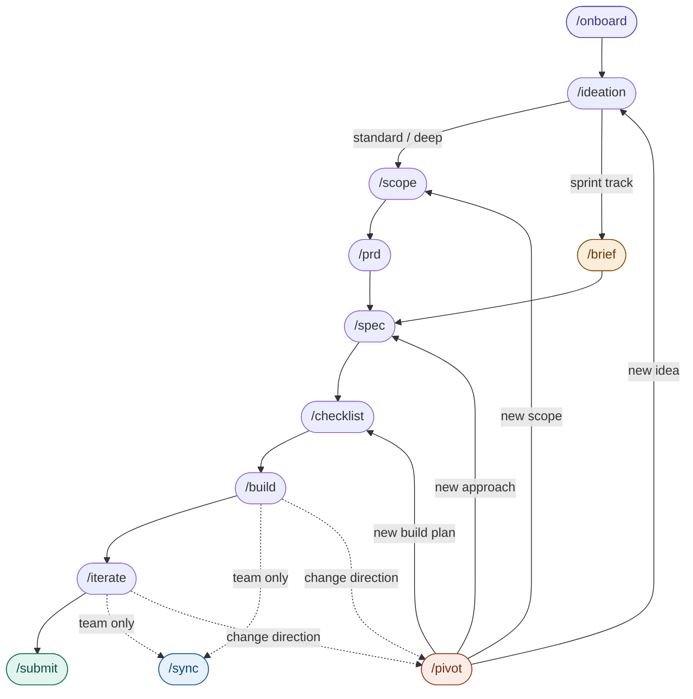

# SprintFlow

SprintFlow is a Claude Code plugin designed for any hackathon. It guides you from hackathon brief to working submission — through structured ideation, spec-driven planning, and time-aware build execution. Designed as a general-purpose tool for solo hackers or teams.

Inspired by [Devpost's hackathon-in-a-plugin](https://learn-ai.devpost.com/) and [ElevenLabs' hackathon submission guide](https://hacks.elevenlabs.io/guide), 

### Install

```
/plugin marketplace add 11bho11/sprintflow
/plugin install sprintflow
```

### How it works
SprintFlow is a chain of slash commands. Each command produces a planning artifact in your `docs/` folder — you run `/clear` between commands, and the docs carry the state forward.

| Command | What it does |
|---|---|
| `/onboard` | Captures the hackathon brief, your profile, team composition, and sets the build track |
| `/ideation` | Re-entrant brainstorm session — validates ideas against judging criteria and timeline |
| `/scope` | Sharpens the committed idea into a concrete user, problem, and explicit cuts |
| `/prd` | Turns the scope into user stories, acceptance criteria, and non-goals |
| `/spec` | Builds the technical blueprint — stack, architecture, file structure, data flow |
| `/checklist` | Sequences the build into verifiable steps with time budget and ownership |
| `/build` | Executes the checklist in step-by-step or autonomous mode |
| `/iterate` | Polish and adjust mid-build or post-build before submission |
| `/submit` | Submission readiness check, video guidance, description, and social posting |
| `/pivot` | Archives existing artifacts and resets to the right phase when direction changes |
| `/sync` | Mid-hackathon team status summary — what's done, blocked, and at risk *(team only)* |

### Mermaid Diagram


### What gets produced
By the time you reach `/build`, your `docs/` folder contains:
```
docs/
├── hackathon-brief.md      ← judging criteria, timeline, rules, submission requirements
├── learner-profile.md      ← your background and goals
├── team-profile.md         ← team skills and ownership (team projects)
├── ideation-log.md         ← all ideas explored, alignment checks, final verdict
├── scope.md                ← sharpened idea, user, problem, explicit cuts
├── prd.md                  ← user stories, acceptance criteria, non-goals
├── spec.md                 ← architecture, stack, file structure, data flow
└── checklist.md            ← sequenced build steps with owners and time budget
```
These aren't throwaway scaffolding. They're the decision record for your project — useful for post-hackathon retrospectives, portfolio writeups, or starting the next one faster.

### Designed for


- Solo hackers and teams up to ~4 people
- Any hackathon theme, track, or judging rubric
- Any experience level — stack recommendations adapt to what you know

### Build tracks

SprintFlow sets a build track during `/onboard` based on your available hours:

| Track | Hours | Planning depth |
|-------|-------|----------------|
| Sprint | ≤6h | `/scope` and `/prd` merged into `/brief`; lightweight spec; no deepening rounds |
| Standard | 6–16h | Full command chain; deepening rounds optional |
| Deep | 16h+ | Full chain; deepening rounds actively encouraged |

You can override the track at any point.

---

## Commands

### `/onboard`
Entry point. Captures two things before any planning begins:

**Hackathon brief** — name, theme, judging criteria and weights, timeline, rules and constraints, submission requirements. This governs everything downstream: how deep the planning goes, which ideas are viable, what the build must produce.

**Participant profile** — technical experience, prior hackathon history, goals for this event.

If you're on a team, `/onboard` also captures team composition and skill distribution into `docs/team-profile.md`.


### `/ideation`
Brainstorm and validate your idea. This command is **re-entrant** — you can run it multiple times across `/clear` cycles without losing progress. Each session reads from `docs/ideation-log.md` and resumes.

Every idea gets checked against the hackathon's specific judging criteria, timeline, and constraints before you commit to it. When you're ready to land on an idea, `/ideation` produces a written verdict explaining why that idea is right for this hackathon.

If a brainstorm session runs long, the agent will prompt you to `/clear` and restart — all ideas are preserved in the log and picked up cleanly next session.


### `/scope`
Takes the committed idea and makes it concrete: sharp user definition, specific problem statement, realistic scope given available time, and explicit cuts. No new ideas — pure sharpening.

*Not used in sprint track (≤6 hours) — use `/brief` instead, which merges scope and PRD.*


### `/prd`
Translates the scope into complete product requirements: user stories grouped into epics, testable acceptance criteria, edge cases, and explicit non-goals. Every requirement gets cross-referenced against the hackathon's judging rubric so nothing important gets missed.

*Not used in sprint track.*


### `/spec`
Builds the technical blueprint with you. Stack selection is driven by a decision framework that accounts for hackathon constraints, required technologies, team skill sets, and available time. Every proposed library or API gets verified against current documentation before it appears in the spec.


### `/checklist`
Breaks the spec into sequenced, verifiable build steps. Each item has five fields: spec reference, what to build, acceptance criteria, verification step, and owner (team mode). The last item is always a submission task written specifically for your hackathon's platform and requirements.

Includes a time budget check: estimated hours per item vs available hours, before you start building.


### `/build`
Executes the checklist. Supports two modes:

- **Step-by-step**: one checklist item per `/build` run, with per-item verification
- **Autonomous**: all items in one session

At any point during build you can call `/iterate` without finishing the checklist — you don't need to complete all items first.


### `/iterate`
Works in two modes:

- **Mid-build**: called after any checklist item to adjust something before continuing. Assesses impact on remaining items and time before making changes.
- **Post-build**: called after all items are complete to polish, add a feature, or fix something before submission. Opens with a plan-vs-reality pass — compares what was built against the original PRD acceptance criteria.

No gate on checklist completion. Call it whenever it's useful.


### `/pivot` — utility
Handles direction changes mid-workflow. Nothing gets deleted — prior artifacts are archived to `docs/archive/v1/` and the workflow resets to the appropriate phase.

- Completely different idea → resets to `/ideation`
- Same idea, different scope → resets to `/scope`
- Same scope, different technical approach → resets to `/spec`
- Same spec, different build plan → resets to `/checklist`


### `/sync` — utility, team only
Produces a 60-second team status summary: what's done, in progress, not started, and blocked — with a risk flag if current pace puts submission at risk. No artifact produced. Stateless — no `/clear` needed after running it.

---

## Contributing

Issues and PRs welcome. If you find a command produces a worse result for a specific hackathon type or time constraint, open an issue describing the context — the goal is for the planning depth to be genuinely useful across the full range of hackathon formats.

---

## License

MIT
